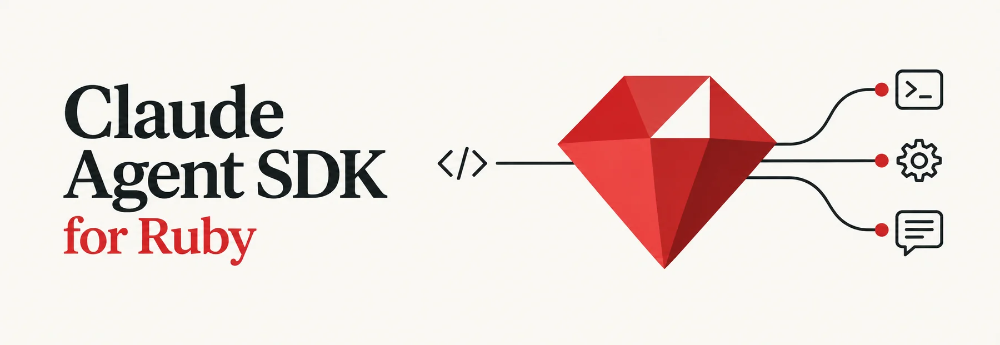

# Claude Agent SDK for Ruby

[](https://rubygems.org/gems/claude-agent-sdk)
[](https://github.com/ya-luotao/claude-agent-sdk-ruby/actions/workflows/ci.yml)
[](https://www.ruby-lang.org/)
[](https://rubydoc.info/gems/claude-agent-sdk)
[](LICENSE)

A Ruby SDK for the [Claude Code](https://docs.claude.com/en/docs/claude-code-overview) agent runtime, built for running agents in production Ruby and Rails apps. It has the same capabilities as the official [TypeScript](https://github.com/anthropics/claude-agent-sdk-typescript) and [Python](https://github.com/anthropics/claude-agent-sdk-python) SDKs, plus what a Rails deploy needs around them: a generator and CLI-vendoring rake task, callbacks that are safe to touch ActiveRecord from, a pinned CLI binary, built-in OpenTelemetry tracing, and transcript mirroring to your own storage.

> **Unofficial and community-maintained.** This project is not affiliated with or supported by Anthropic. It tracks the official SDKs release by release; see the [CHANGELOG](CHANGELOG.md) for the currently synced version.

## Highlights

- **Rails integration.** `bin/rails generate claude_agent_sdk:install` writes the initializer and `bin/rails claude_agent_sdk:install_cli` vendors the CLI; [docs/rails.md](docs/rails.md) covers jobs, ActionCable streaming, session resumption, and solid_queue fiber workers (`callback_scheduling: :inline`).
- **Callbacks that are safe around ActiveRecord.** Tool handlers, hooks, permission callbacks, and message blocks run on a plain thread by default, outside the SDK's fiber scheduler, so thread-keyed libraries (ActiveRecord, `pg`, per-thread caches) behave as they do everywhere else in your app. `ClaudeAgentSDK::Railtie.callback_wrapper` runs them in the Rails executor so connections go back to the pool, without deadlocking development code reloading.
- **Hermetic deploys.** `CLIInstaller` vendors a checksum-verified CLI binary, pinned to the version each gem release is tested with, so production never depends on a global `npm install`.
- **Built-in OpenTelemetry observer** with Langfuse support; no third-party instrumentation library required.
- **Transcript mirroring.** A `SessionStore` adapter mirrors session transcripts to your own storage (reference adapters for Postgres, Redis, and S3, plus a conformance suite), and sessions can be resumed from it on another host.
- **Same wire protocol as the official SDKs.** Spawns the `claude` CLI as a subprocess and speaks stream-JSON over stdin/stdout, so every feature of the runtime is available: sessions, subagents, sandboxing, structured output, file checkpointing and rewind.
- **`query()` for one-shot calls, `Client` for bidirectional sessions** with interrupts, mid-session model switching, and streaming input from any `Enumerator`.
- **In-process custom tools.** Define tools as Ruby blocks; they run inside your process with direct access to your app state (SDK MCP servers), with JSON-Schema-validated arguments.
- **All 27 hook events and permission callbacks** with typed inputs, so you can gate, audit, or rewrite every tool call.
- **Pluggable transport** to run the CLI somewhere else (an E2B microVM, a container, over SSH).

## Installation

```ruby
# Gemfile
gem 'claude-agent-sdk', '~> 0.36.0'
```

Then `bundle install`, or install directly with `gem install claude-agent-sdk`. To track unreleased changes, point the Gemfile at GitHub: `gem 'claude-agent-sdk', github: 'ya-luotao/claude-agent-sdk-ruby'`.

**Prerequisites**

- Ruby 3.2 or newer
- Claude Code CLI 2.0.0 or newer, either installed globally (`npm install -g @anthropic-ai/claude-code`) or vendored with `CLIInstaller`:

```ruby
# bin/setup or a cached Docker layer — pin a concrete version in production
ClaudeAgentSDK::CLIInstaller.install(version: '2.1.220')  # => "/app/vendor/claude/claude"
```

The vendored binary is found ahead of `PATH`, installs are idempotent and concurrency-safe, and a failed upgrade never breaks a working install. See [docs/cli-installer.md](docs/cli-installer.md) for the full behaviour, supported platforms, and the CLI discovery order.

### Rails in a minute

```bash
bundle add claude-agent-sdk
bin/rails generate claude_agent_sdk:install   # config/initializers/claude_agent_sdk.rb + .gitignore entry
bin/rails claude_agent_sdk:install_cli        # the tested CLI into vendor/claude (also a Docker build step)
```

```ruby
# app/jobs/summarize_ticket_job.rb
class SummarizeTicketJob < ApplicationJob
  def perform(ticket)
    options = ClaudeAgentSDK::ClaudeAgentOptions.new(tools: [], max_turns: 1)
    prompt = "Summarize this support ticket in two sentences:\n\n#{ticket.body}"

    ClaudeAgentSDK.query(prompt: prompt, options: options) do |message|
      ticket.update!(summary: message.result) if message.is_a?(ClaudeAgentSDK::ResultMessage)
    end
  end
end
```

The block runs on a plain thread, so ActiveRecord calls inside it just work. [docs/rails.md](docs/rails.md) continues with multi-turn sessions, ActionCable streaming, and fiber workers.

## Quick Start

```ruby
require 'claude_agent_sdk'

puts ClaudeAgentSDK.ask("What is 2 + 2?").result
```

`ask` runs the whole conversation and returns the final `ResultMessage`: `#result` is the answer, and the same object carries `total_cost_usd`, `usage`, `session_id` and `structured_output` (`puts` on it prints a summary such as `[result: success, 1 turn, 2.1s, $0.0031]`). It takes the same prompt and `options:` as `query()`, and given a block it also yields every message as it arrives:

```ruby
result = ClaudeAgentSDK.ask("Explain Ruby's GVL in three sentences") do |message|
  puts message.text if message.is_a?(ClaudeAgentSDK::AssistantMessage)
end
puts result
```

It raises the same errors as `query()` (see [docs/errors.md](docs/errors.md)), plus `CLIConnectionError` if the stream ends without a result.

### `query()` — one-shot and streaming

`query()` runs a single conversation and yields each response message to the block. Reach for it over `ask` when you handle the messages yourself, or want to stop early with `break`.

```ruby
options = ClaudeAgentSDK::ClaudeAgentOptions.new(
  system_prompt: "You are a helpful assistant",
  allowed_tools: ['Read', 'Write', 'Bash'],
  permission_mode: 'acceptEdits',
  cwd: "/path/to/project",
  max_turns: 5
)

ClaudeAgentSDK.query(prompt: "Create a hello.rb file", options: options) do |message|
  puts message
end
```

Pass an `Enumerator` instead of a string to stream several user messages into one session:

```ruby
stream = ClaudeAgentSDK::Streaming.from_array(['Hello!', 'What is 2+2?', 'Thanks!'])

ClaudeAgentSDK.query(prompt: stream) do |message|
  puts message if message.is_a?(ClaudeAgentSDK::AssistantMessage)
end
```

### `Client` — bidirectional sessions

`Client` keeps a session open so you can send follow-up queries, interrupt, switch models, and use hooks, permission callbacks, and custom tools. `Client.open` connects, yields the client, and always disconnects when the block exits, even on an exception. It returns the block's value.

```ruby
require 'claude_agent_sdk'

ClaudeAgentSDK::Client.open do |client|
  client.query("What is the capital of France?")
  client.receive_response { |msg| puts msg }

  client.query("And of Germany?")
  client.receive_response { |msg| puts msg }
end
```

`Client.open` creates an [`async`](https://github.com/socketry/async) reactor when there isn't one; blocking calls yield automatically, no `await` needed. Called outside a reactor, `break` inside the block raises `LocalJumpError` (the client still disconnects), so return a value instead. Code that is already running inside an `Async` reactor can also manage the lifecycle by hand:

```ruby
client = ClaudeAgentSDK::Client.new
begin
  client.connect
  client.query("What is the capital of France?")
  client.receive_response { |msg| puts msg }
ensure
  client.disconnect
end
```

See [docs/client.md](docs/client.md) for `interrupt`, mid-session model and permission switching, MCP status, and custom transports.

### Custom tools (SDK MCP servers)

Tools are Ruby blocks that run in-process, with no subprocess or IPC between Claude's tool call and your code.

```ruby
greet = ClaudeAgentSDK.create_tool('greet', 'Greet a user', { name: :string }) do |args|
  "Hello, #{args[:name]}!"
end

server = ClaudeAgentSDK.create_sdk_mcp_server(name: 'my-tools', tools: [greet])

options = ClaudeAgentSDK::ClaudeAgentOptions.new(
  mcp_servers: { tools: server },
  allowed_tools: ['mcp__tools__greet']
)
```

A String return is sent to Claude as a single text block. Return a Hash instead (`{ content: [...], is_error: true }`) to flag an error, attach `structured_content:`, or send several content blocks or images. Arguments are validated against the tool's JSON Schema before your handler runs, and handler exceptions are reported back to the model in-band so it can self-correct. See [docs/mcp-servers.md](docs/mcp-servers.md) for resources, prompts, mixed SDK + external servers, and schema details.

### Hooks and permission callbacks

Hooks run your Ruby code at any of the 27 lifecycle events (`PreToolUse`, `PostToolUse`, `UserPromptSubmit`, `Stop`, `PreCompact`, …) with typed inputs. Permission callbacks decide programmatically whether a tool call may proceed.

```ruby
options = ClaudeAgentSDK::ClaudeAgentOptions.new(
  hooks: { 'PreToolUse' => [ClaudeAgentSDK::HookMatcher.new(matcher: 'Bash', hooks: [my_hook])] },
  can_use_tool: my_permission_callback
)
```

See [docs/hooks-and-permissions.md](docs/hooks-and-permissions.md) for the full event list and worked examples.

## Documentation

| Topic | Guide |
|-------|-------|
| `Client` advanced features and custom transports | [docs/client.md](docs/client.md) |
| SDK MCP servers: tools, resources, prompts, schema compatibility | [docs/mcp-servers.md](docs/mcp-servers.md) |
| All hook events, typed inputs, permission callbacks | [docs/hooks-and-permissions.md](docs/hooks-and-permissions.md) |
| Structured output, thinking, budget, fallback and advisor models, sandbox, bare mode, checkpointing | [docs/configuration.md](docs/configuration.md) |
| Session listing, reading, renaming, tagging, forking, resume-at-message | [docs/sessions.md](docs/sessions.md) |
| Subagent capabilities, event contracts, and minimal example | [docs/subagents.md](docs/subagents.md) |
| OpenTelemetry tracing, Langfuse, custom observers | [docs/observability.md](docs/observability.md) |
| Rails: generator, `install_cli` task, callback wrapper, fiber safety, solid_queue fiber workers, ActionCable, jobs | [docs/rails.md](docs/rails.md) |
| Vendoring a pinned CLI binary and CLI discovery order | [docs/cli-installer.md](docs/cli-installer.md) |
| Hash-key rule, attribute access, and the message, content block, and configuration type reference | [docs/types.md](docs/types.md) |
| Error handling, exception hierarchy, timeouts | [docs/errors.md](docs/errors.md) |

API reference: [rubydoc.info/gems/claude-agent-sdk](https://rubydoc.info/gems/claude-agent-sdk). Available built-in tools: [Claude Code documentation](https://docs.anthropic.com/en/docs/claude-code/settings#tools-available-to-claude).

## Examples

Runnable scripts live in [`examples/`](https://github.com/ya-luotao/claude-agent-sdk-ruby/tree/main/examples).

| Area | Examples |
|------|----------|
| Getting started | [quick_start](https://github.com/ya-luotao/claude-agent-sdk-ruby/blob/main/examples/quick_start.rb) · [client](https://github.com/ya-luotao/claude-agent-sdk-ruby/blob/main/examples/client_example.rb) · [streaming_input](https://github.com/ya-luotao/claude-agent-sdk-ruby/blob/main/examples/streaming_input_example.rb) · [message_types](https://github.com/ya-luotao/claude-agent-sdk-ruby/blob/main/examples/message_types_example.rb) · [error_handling](https://github.com/ya-luotao/claude-agent-sdk-ruby/blob/main/examples/error_handling_example.rb) |
| Sessions and output | [session_resumption](https://github.com/ya-luotao/claude-agent-sdk-ruby/blob/main/examples/session_resumption_example.rb) · [structured_output](https://github.com/ya-luotao/claude-agent-sdk-ruby/blob/main/examples/structured_output_example.rb) · [extended_thinking](https://github.com/ya-luotao/claude-agent-sdk-ruby/blob/main/examples/extended_thinking_example.rb) · [session_stores/](https://github.com/ya-luotao/claude-agent-sdk-ruby/blob/main/examples/session_stores/README.md) |
| Tools and MCP | [mcp_calculator](https://github.com/ya-luotao/claude-agent-sdk-ruby/blob/main/examples/mcp_calculator.rb) · [mcp_resources_prompts](https://github.com/ya-luotao/claude-agent-sdk-ruby/blob/main/examples/mcp_resources_prompts_example.rb) · [http_mcp_server](https://github.com/ya-luotao/claude-agent-sdk-ruby/blob/main/examples/http_mcp_server_example.rb) |
| Hooks and permissions | [hooks](https://github.com/ya-luotao/claude-agent-sdk-ruby/blob/main/examples/hooks_example.rb) · [advanced_hooks](https://github.com/ya-luotao/claude-agent-sdk-ruby/blob/main/examples/advanced_hooks_example.rb) · [lifecycle_hooks](https://github.com/ya-luotao/claude-agent-sdk-ruby/blob/main/examples/lifecycle_hooks_example.rb) · [permission_callback](https://github.com/ya-luotao/claude-agent-sdk-ruby/blob/main/examples/permission_callback_example.rb) |
| Models and limits | [budget_control](https://github.com/ya-luotao/claude-agent-sdk-ruby/blob/main/examples/budget_control_example.rb) · [fallback_model](https://github.com/ya-luotao/claude-agent-sdk-ruby/blob/main/examples/fallback_model_example.rb) · [advisor](https://github.com/ya-luotao/claude-agent-sdk-ruby/blob/main/examples/advisor_example.rb) · [bare_mode](https://github.com/ya-luotao/claude-agent-sdk-ruby/blob/main/examples/bare_mode_example.rb) · [sandbox](https://github.com/ya-luotao/claude-agent-sdk-ruby/blob/main/examples/sandbox_example.rb) |
| Rails, observability, transports | [rails_actioncable](https://github.com/ya-luotao/claude-agent-sdk-ruby/blob/main/examples/rails_actioncable_example.rb) · [rails_background_job](https://github.com/ya-luotao/claude-agent-sdk-ruby/blob/main/examples/rails_background_job_example.rb) · [otel_langfuse](https://github.com/ya-luotao/claude-agent-sdk-ruby/blob/main/examples/otel_langfuse_example.rb) · [e2b_transport](https://github.com/ya-luotao/claude-agent-sdk-ruby/blob/main/examples/e2b_transport_example.rb) |

## Comparison with the official SDKs

All three SDKs drive the same CLI over the same protocol, so capabilities line up feature for feature. Ruby differs mainly in idiom: `Enumerator` for streaming input, blocks for tools, and the `async` gem with fibers instead of `async`/`await`.

| Capability | TypeScript | Python | Ruby (this gem) |
|---|:---:|:---:|:---:|
| One-shot `query()` | ✅ | ✅ | ✅ |
| Bidirectional `Client` | ✅ | ✅ | ✅ |
| Streaming input | `AsyncIterable` | `AsyncIterable` | `Enumerator` |
| Custom tools (SDK MCP servers) | `tool()` | `@tool` decorator | `create_tool` block |
| Hooks (all 27 events) | ✅ | ✅ | ✅ |
| Permission callbacks | ✅ | ✅ | ✅ |
| Structured output | ✅ | ✅ | ✅ |
| All 28 message types | ✅ | partial | ✅ |
| [Sandbox](https://github.com/anthropic-experimental/sandbox-runtime) settings | ✅ | partial | ✅ |
| Bare mode (`--bare`) | ✅ | ✅ | ✅ |
| File checkpointing & rewind | ✅ | ✅ | ✅ |
| Session browsing & mutations | ✅ | ✅ | ✅ |
| Programmatic subagents | ✅ | ✅ | ✅ |
| CLI binary | bundled | bundled | vendored on demand (`CLIInstaller`) |
| Observability (OTel / Langfuse) | via [Arize](https://github.com/Arize-ai/openinference) | — | ✅ built-in |
| Custom transport (pluggable I/O) | — | — | ✅ |
| Rails integration | — | — | ✅ |

Types are plain Ruby classes with `attr_accessor` and keyword arguments, mirroring the field names of the TypeScript Zod schemas and Python dataclasses; there is no runtime type checking.

## Claude Code plugin

This repository is also a Claude Code plugin marketplace. The bundled skill teaches Claude Code the gem's APIs and patterns:

```bash
/plugin marketplace add ya-luotao/claude-agent-sdk-ruby
/plugin install claude-agent-ruby@claude-agent-sdk-ruby
```

## Development

```bash
bundle install
bundle exec rspec                    # unit suite
bundle exec rubocop                  # lint
RUN_INTEGRATION=1 bundle exec rspec  # also run the real-CLI integration suite (needs `claude` and ANTHROPIC_API_KEY)
BUNDLE_GEMFILE=gemfiles/rails_8.gemfile bundle exec rspec --options spec/rails/.rspec  # Rails integration specs
```

CI runs the suite and RuboCop on Ruby 3.2, 3.3, and 3.4 on Linux, the suite on macOS, and the Rails specs against Rails 7.1 and 8; a weekly job runs the integration suite against the pinned CLI. See [CONTRIBUTING.md](https://github.com/ya-luotao/claude-agent-sdk-ruby/blob/main/CONTRIBUTING.md) for the development setup and [spec/README.md](https://github.com/ya-luotao/claude-agent-sdk-ruby/blob/main/spec/README.md) for the test layout.

## Contributing

Bug reports and pull requests are welcome on [GitHub](https://github.com/ya-luotao/claude-agent-sdk-ruby/issues). Please include a failing spec with bug reports where possible, and keep pull requests focused on one change; [CONTRIBUTING.md](https://github.com/ya-luotao/claude-agent-sdk-ruby/blob/main/CONTRIBUTING.md) has the details. Report security vulnerabilities privately, as described in [SECURITY.md](https://github.com/ya-luotao/claude-agent-sdk-ruby/blob/main/SECURITY.md). Releases follow [Semantic Versioning](https://semver.org/) and are recorded in the [CHANGELOG](CHANGELOG.md).

## License

Released under the [MIT License](LICENSE).
